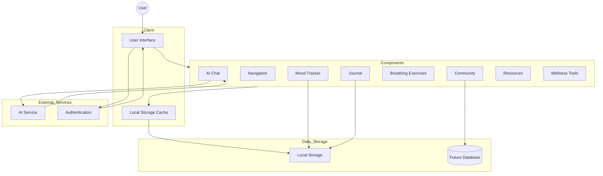
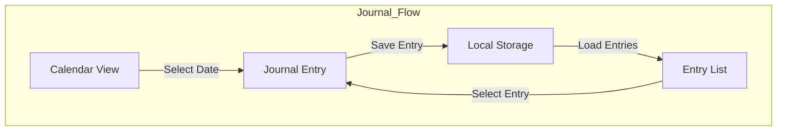
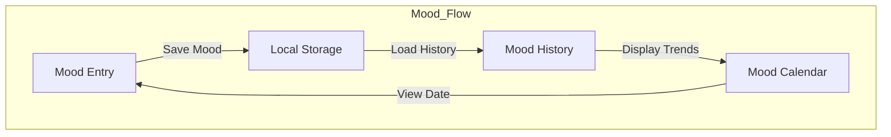
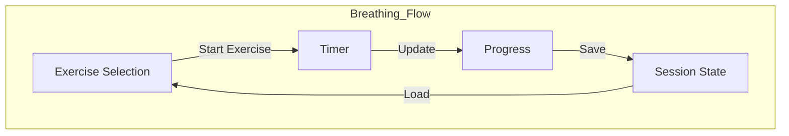

# Sukoon Data Flow Diagram

## System Overview



## Component-Level Data Flow

### 1. Journal Component


### 2. Mood Tracker Component


### 3. Breathing Exercise Component


## Data Models

### Journal Entry
```typescript
type JournalEntry = {
    id: string
    date: string
    title: string
    content: string
}
```

### Mood Entry
```typescript
type MoodEntry = {
    id: string
    date: string
    mood: "great" | "good" | "okay" | "bad" | "awful"
    note: string
}
```

### Community Post
```typescript
type Post = {
    id: string
    author: {
        name: string
        avatar: string
    }
    content: string
    likes: number
    comments: number
    time: string
}
```

## Data Flow Description

1. **User Authentication**
   - User authentication state is managed globally
   - Auth tokens stored in secure HTTP-only cookies
   - Protected routes require valid authentication

2. **Local Storage**
   - Journal entries stored with unique IDs
   - Mood entries tracked with timestamps
   - User preferences and settings cached
   - Exercise progress saved locally

3. **State Management**
   - Component-level state using React useState
   - Shared state handled through context
   - Real-time updates for interactive features

4. **External Services**
   - AI chat integration for mental health support
   - Future database integration for community features
   - Authentication service for user management

5. **Data Persistence**
   - Automatic saving of journal entries
   - Real-time mood tracking updates
   - Progress tracking for exercises
   - Community interactions stored in database

6. **Error Handling**
   - Failed API calls gracefully degraded
   - Local storage fallbacks
   - User feedback for data operations
   - Retry mechanisms for network issues 